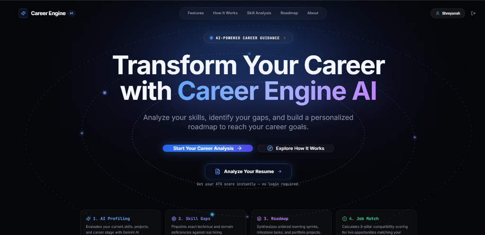

# 🧭 Career Engine AI — Intelligent Career Intelligence & ATS Platform

<div align="center">

[](https://career-engine-ai-web.onrender.com)

### **Transform Your Career with AI-Powered Intelligence**
*Analyze your skills, identify your gaps, and build a personalized roadmap to reach your career goals.*

[](https://career-engine-ai-web.onrender.com)
[](https://career-engine-ai.onrender.com)
[](https://github.com/shreyverse/career-engine-ai)

</div>

---

## 🚀 Live Links

- **🌐 Live Web Application**: [https://career-engine-ai-web.onrender.com](https://career-engine-ai-web.onrender.com)
- **⚡ Backend API Service**: [https://career-engine-ai.onrender.com](https://career-engine-ai.onrender.com)
- **📦 GitHub Repository**: [https://github.com/shreyverse/career-engine-ai](https://github.com/shreyverse/career-engine-ai)

---

## 🎯 What is Career Engine AI?

Career Engine AI is an enterprise-grade AI career platform engineered to guide **university students, freshers, and working professionals** from their current standing to their dream career milestones.

### 🌟 Key Features

1. **📄 Multi-Stage Agentic ATS Resume Analyzer**:
   - **No guessing or arbitrary scoring**: Powered by an automated 6-agent pipeline (*Extraction, Quality, Relevance, Deterministic Scoring, and Critic Agents*).
   - Instant ATS score (0-100) benchmarked across 60+ canonical technical skills and role-specific hiring matrices (*Software Engineer, Frontend, Backend, AI/ML, DevOps*).
   - Section-level evidence tracking (*Technical Skills, Projects, Work History*) with zero hallucinations and zero contradictory recommendations.

2. **🗺️ Dynamic Career Roadmaps & Milestone Sprints**:
   - Personalized, step-by-step career path generation based on target roles and current skill profiles.

3. **📊 Skill Gap Matrix & Diagnostic Assessments**:
   - Interactive skill proficiency heatmaps identifying exact technologies to learn to qualify for top-tier roles.

4. **🔐 Enterprise Authentication & Cloud Security**:
   - Seamless **Google OAuth 2.0** and JWT authentication with encrypted session state.

---

## 🛠️ Technology Stack

| Layer | Technologies |
| :--- | :--- |
| **Frontend** | React 18, TypeScript, Vite, Tailwind CSS, Lucide Icons, React Router v6 |
| **Backend** | Node.js, Express.js, TypeScript, Google GenAI SDK, Multer, Helmet, CORS |
| **AI / GenAI** | Google Gemini 2.5 Flash, Deterministic Regex Heuristics, Multi-Agent Orchestration |
| **Database & ORM** | PostgreSQL, Prisma ORM, In-Memory Storage Engine |
| **Deployment** | Render (Web Static Site + Node.js API Service) |

---

## 📂 Project Structure

```
career-engine/
├── assets/                       # Screenshots and preview media
│   └── career-engine-preview.png # Landing page preview banner
├── frontend/                     # React 18 + Vite + Tailwind Client
│   ├── src/
│   │   ├── components/           # UI components, modals, and landing sections
│   │   │   ├── auth/             # GoogleAuthButton and login flows
│   │   │   ├── landing/          # HeroSection, HowItWorks, Visualizers
│   │   │   ├── resume/           # ResumeAnalysisModal & ATS scoring widgets
│   │   │   └── ui/               # Reusable atomic UI components
│   │   ├── pages/                # Landing, Onboarding, Dashboard, Analyzer
│   │   ├── services/             # Typed API client and resume upload services
│   │   └── types/                # Shared TypeScript definitions
│   └── package.json
│
├── backend/                      # Express + TypeScript API Server
│   ├── src/
│   │   ├── ats/                  # Multi-Stage ATS Agent Pipeline
│   │   │   ├── ats.taxonomy.ts   # 60+ Canonical Skill Taxonomy
│   │   │   ├── ats.benchmarks.ts # Role benchmark hiring matrices
│   │   │   ├── ats.extraction.agent.ts # Resume factual extractor
│   │   │   ├── ats.quality.agent.ts    # Structure & metric analyzer
│   │   │   ├── ats.relevance.agent.ts  # Role matching & evidence mapper
│   │   │   ├── ats.scoring.ts    # Deterministic 6-pillar scoring engine
│   │   │   ├── ats.critic.agent.ts     # Anti-hallucination reviewer
│   │   │   └── ats.pipeline.ts   # Pipeline orchestrator
│   │   ├── config/               # Environment & Database config
│   │   ├── controllers/          # API Route controllers
│   │   ├── middleware/           # Auth, Multer upload & Error handlers
│   │   └── server.ts             # Express server entry point
│   └── package.json
│
├── prisma/                       # PostgreSQL schema definitions
├── docs/                         # Architecture & design documentation
├── render.yaml                   # Infrastructure-as-code for Render deployment
└── README.md
```

---

## 🚀 Getting Started Locally

### 1. Prerequisites
- **Node.js**: v18.0.0 or higher (v20+ recommended)
- **npm**: v8.0.0 or higher
- **Gemini API Key**: (Get one from [Google AI Studio](https://aistudio.google.com/))

### 2. Installation
Clone the repository and install dependencies:

```bash
git clone https://github.com/shreyverse/career-engine-ai.git
cd career-engine-ai

# Install backend dependencies
cd backend && npm install

# Install frontend dependencies
cd ../frontend && npm install
```

### 3. Environment Setup
Create `.env` in `backend/`:
```env
PORT=5000
NODE_ENV=development
JWT_SECRET=your_jwt_secret_key
GEMINI_API_KEY=your_gemini_api_key
GOOGLE_CLIENT_ID=your_google_client_id
```

### 4. Running the Application

**Run Backend API Server (Port 5000):**
```bash
cd backend && npm run dev
```

**Run Frontend Client (Port 3000 / 5173):**
```bash
cd frontend && npm run dev
```

---

## 📄 License
This project is licensed under the MIT License.

