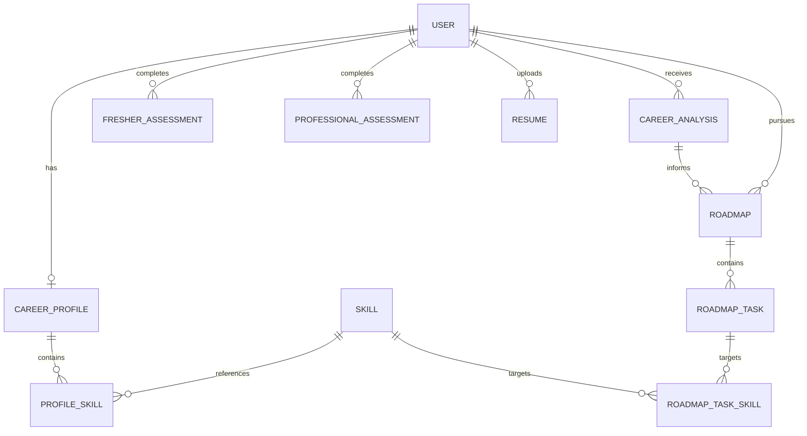

# Career Engine — System Architecture & Design Specification

**Phase 1: Foundation, Architecture & Design System**  
**Version:** 1.0.0  
**Status:** Complete  

---

## 1. System Overview

Career Engine is an enterprise-grade AI-powered Career Intelligence Platform architected to bridge the gap between education, skill acquisition, and real-world career trajectory. The system serves two primary personas:
1. **Freshers & Students**: Going from raw interest & aptitude → foundational technical skills → verifiable portfolio projects → ATS-optimized resume → structured interview preparation → job placement.
2. **Working Professionals**: Going from current role & seniority → target career vision → deep skill gap diagnostic → sprint-based learning plan → promotion, lateral pivot, or salary acceleration.

Phase 1 establishes the bedrock: a modern monorepo layout, a custom Obsidian & Indigo design system, reusable component library, accessible routing shells, an Express/TypeScript API with structured error handling, a PostgreSQL database schema using Prisma ORM, and comprehensive architectural blueprints.

---

## 2. Monorepo Structure

The workspace is organized into a modular multi-tier structure:

```
career-engine/
├── frontend/                 # React 18 + Vite + TypeScript + Tailwind CSS Client
│   ├── src/
│   │   ├── assets/           # Static media assets, vectors & SVG icons
│   │   ├── components/
│   │   │   ├── ui/           # Atomic, reusable design system components
│   │   │   ├── layout/       # Structural layouts (Container, Section, Navbar, Sidebar, AppLayout)
│   │   │   └── landing/      # High-impact landing page experience sections
│   │   ├── pages/            # View routes (Landing, Auth, Onboarding, Dashboard, Modules)
│   │   ├── routes/           # React Router declarative routing tree
│   │   ├── hooks/            # Reusable UI & business hooks (useToast, useTheme)
│   │   ├── services/         # Typed API clients & fetch wrappers
│   │   ├── lib/              # Utility helpers (cn class merging)
│   │   ├── types/            # TypeScript interfaces & domain types
│   │   └── constants/        # Design tokens, step definitions & feature catalogs
│   ├── public/               # Public assets and favicon
│   ├── tailwind.config.js    # Central design token configuration
│   ├── tsconfig.json         # TypeScript compiler configuration
│   └── vite.config.ts        # Vite build tool and API proxying
│
├── backend/                  # Node.js + Express + TypeScript REST API
│   ├── src/
│   │   ├── config/           # Environment variable validation & server config
│   │   ├── controllers/      # Request handlers (HealthController, etc.)
│   │   ├── middleware/       # Error handling, request logging & security
│   │   ├── routes/           # Versioned REST route definitions
│   │   ├── services/         # Core business logic & data operations
│   │   ├── types/            # API response envelopes & domain interfaces
│   │   ├── utils/            # Standard response helpers (sendSuccess, sendError)
│   │   ├── app.ts            # Express application factory & middleware setup
│   │   └── server.ts         # Server lifecycle & graceful shutdown handlers
│   ├── tsconfig.json         # Backend TypeScript compilation
│   └── package.json          # Backend dependencies
│
├── prisma/
│   └── schema.prisma         # Scalable PostgreSQL schema modeling 9 core entities
│
├── docs/
│   ├── architecture.md       # Detailed technical architecture specification
│   └── design-system.md      # Design system documentation & token guide
│
├── .env.example              # Centralized environment variable template
├── .gitignore                # Workspace gitignore rules
├── package.json              # Monorepo root scripts & tooling
└── README.md                 # Complete project guide and setup instructions
```

---

## 3. Frontend Architecture

### 3.1 Design System & Aesthetic Foundation
The frontend visual identity is designed from first principles with an **editorial + modern product aesthetic**:
- **Palette**: Obsidian Charcoal (`#090D16`), Surface (`#0F172A`), Elevated Surface (`#131D31`), Primary Indigo (`#6366F1`), Secondary Violet (`#8B5CF6`), Emerald (`#10B981`), and Slate (`#94A3B8`).
- **Typography**: Plus Jakarta Sans (Display Headings), Inter (Body & Controls), JetBrains Mono (Technical Data, Metrics & Badges).
- **Subtle Motion**: Micro-interactions, soft radial glows, and reduced-motion fallbacks.

### 3.2 Component Architecture
Components are structured into clear tiers:
- **Primitives (`ui/`)**: `Button`, `Input`, `PasswordInput`, `Select`, `Textarea`, `Checkbox`, `Radio`, `SearchInput`, `Card`, `Badge`, `Metric`, `ProgressBar`, `ProgressRing`, `StatusIndicator`, `Alert`, `Toast`, `Spinner`, `EmptyState`, `ErrorState`.
- **Layouts (`layout/`)**: `Container`, `Section`, `Stack`, `Grid`, `Navbar`, `MobileNav`, `Footer`, `Sidebar`, `Breadcrumb`, `AppLayout`.
- **Composed Experiences (`landing/`, `pages/`)**: `HeroSection`, `CareerJourneyVisual`, `HowItWorksSection`, `FresherJourneySection`, `ProfessionalJourneySection`, `FeatureGridSection`, `FinalCtaSection`, and workspace pages.

### 3.3 Routing & Navigation Tree
React Router v6 provides client-side navigation across public and workspace routes:
- `/` — Public Landing Page
- `/login`, `/register`, `/forgot-password` — Authentication Shells
- `/onboarding` — Track Selection & Intake Flow
- `/dashboard` — Career Intelligence Central Hub
- `/career-path` — Milestone Roadmap Viewer
- `/skills` — Skill Gap Matrix & Taxonomy Explorer
- `/resume` — Resume Hub & ATS Scanner
- `/progress` — Growth Velocity & Learning Trackers
- `/settings` — Preferences & Account Configuration
- `*` — Accessible 404 Error State

---

## 4. Backend Architecture

### 4.1 Layered Architecture Pattern
The backend adheres to a clean separation of concerns:
```
HTTP Request 
   │
   ▼
[Security & Logging Middleware] (Helmet, CORS, Morgan)
   │
   ▼
[Route Handlers] (/health, /api/*)
   │
   ▼
[Controllers] (Request parsing & response delegation)
   │
   ▼
[Services] (Business logic, calculations & orchestration)
   │
   ▼
[Data Layer] (Prisma Client ↔ PostgreSQL)
   │
   ▼
[Standardized Response Envelope] (sendSuccess / sendError)
```

### 4.2 Standard API Envelopes
All API endpoints follow uniform JSON responses:

**Success Response:**
```json
{
  "success": true,
  "data": { ... },
  "meta": {
    "timestamp": "2026-08-29T11:00:00.000Z"
  }
}
```

**Error Response:**
```json
{
  "success": false,
  "error": {
    "code": "RESOURCE_NOT_FOUND",
    "message": "The requested item was not found."
  },
  "meta": {
    "timestamp": "2026-08-29T11:00:00.000Z"
  }
}
```

---

## 5. Database Architecture (Prisma & PostgreSQL)

The schema defines 9 core entities ready for future phases:



### Core Models:
1. `User`: Identity, authentication credentials, role (USER, ADMIN, MENTOR), and career stage.
2. `CareerProfile`: Target roles, industry preference, compensation targets, and bio.
3. `FresherAssessment`: University details, GPA, foundational interests, and starter skills.
4. `ProfessionalAssessment`: Current role, company, years of experience, current stack, and target goals.
5. `Resume`: File metadata, parsed text, structured extraction JSON, and ATS match score.
6. `Skill`: Taxonomy catalog, domain category, description, and market demand score.
7. `ProfileSkill`: User-acquired skill with proficiency level and verification status.
8. `CareerAnalysis`: AI diagnostic narrative, strengths, critical gaps, and recommendations.
9. `Roadmap` & `RoadmapTask`: Structured learning path, sprint milestones, tasks, and completion tracking.

---

## 6. Future AI & Gemini Integration Pipeline (Phase 3+)

In subsequent phases, Google Gemini 1.5 Pro will power the AI Career Intelligence pipeline:
1. **Intake Payload Aggregation**: User assessment, resume structured extraction, and target job description are consolidated.
2. **Prompt Engineering & Schema Enforcement**: Structured JSON schema output is enforced using Gemini's structured output mode.
3. **Diagnostic Generation**: AI calculates role fit percentage, identifies missing prerequisite competencies, and recommends milestone sprints.
4. **Roadmap Hydration**: Generates discrete tasks with estimated learning hours and curated open-access resources.

---

## 7. Authentication & Security Plan (Phase 2)

- **JWT Dual-Token Architecture**: Short-lived access tokens (15 mins) paired with rotating refresh tokens (30 days) stored in HttpOnly, Secure cookies.
- **OAuth 2.0 Integration**: Google Identity authentication.
- **Role-Based Access Control (RBAC)**: Fine-grained permissions for standard users, mentors, and administrators.
- **Rate Limiting & Sanitation**: Express rate limiters and input validation using Zod schemas.

---

## 8. Data Flow

```
[User Browser]
   │ (HTTPS)
   ▼
[Vite Frontend / CDN] ─── (API Requests) ───► [Express Backend (Port 5000)]
                                                      │
                       ┌──────────────────────────────┴──────────────────────────────┐
                       │                                                             │
                       ▼                                                             ▼
              [PostgreSQL Database]                                         [Gemini AI Engine]
              (Prisma ORM Entities)                                          (Phase 3 Pipeline)
```
